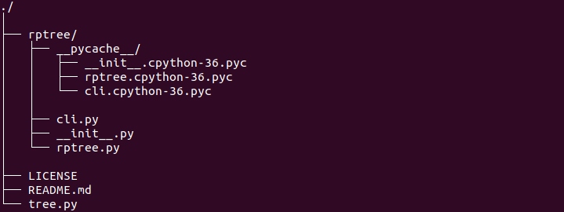

## Description
tree-gen is a clone of tree command. It prints the given directory in a more readable and understandable way.




## Usage

```
usage: tree-gen [-h] [-v] [-a] [-d] [-o [OUTPUT_FILE]] [ROOT_DIR]

Directory Tree Generator

positional arguments:

  ROOT_DIR              Generate a full directory tree starting at ROOT_DIR

optional arguments:

  -h, --help            show this help message and exit

  -v, --version         show program's version number and exit

  -a, --all             Print all files. By default tree-gen does not print

                        hidden files (those beginning with a dot `.').

  -d, --dir-only        Generate a directory-only tree

  -o [OUTPUT_FILE], --output-file [OUTPUT_FILE]

                        Generate a full directory tree and save it to a file

Thanks for using tree-gen
```

## License

Released under the revised  GNU GENERAL PUBLIC LICENSE. See [LICENSE](LICENSE) for details.
